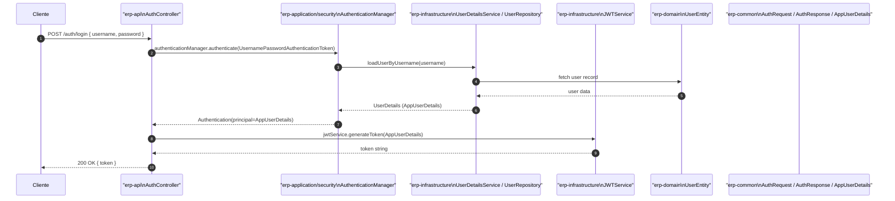

# Diagrama de secuencia — AuthController

Descripción: Flujo de autenticación `login` usando `AuthenticationManager` y `JWTService`. Capas: `erp-api` (controller), `erp-application`/security, `erp-infrastructure` (user repository / user details), `erp-common` (DTOs), `erp-domain` (User entity).

