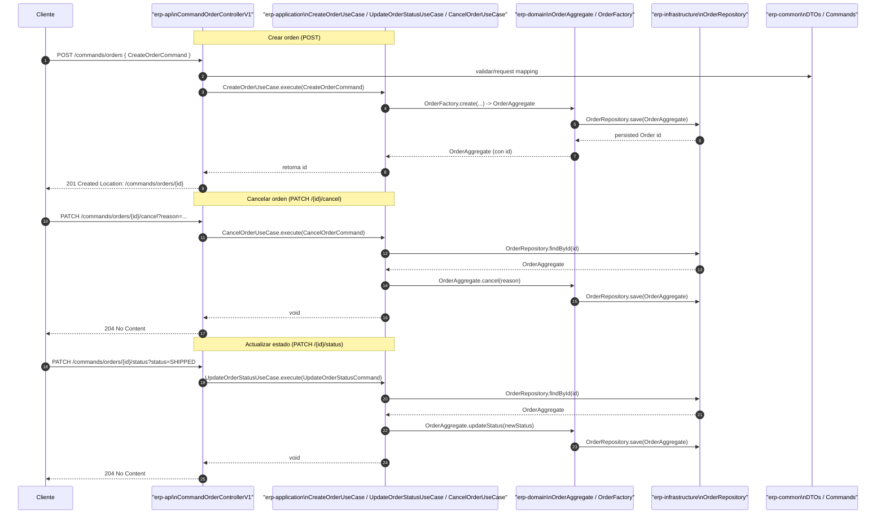

# Diagrama de secuencia — CommandOrderControllerV1

Descripción: Secuencia de la operación `postOrder` y las rutas para `patchOrderCancel` y `patchOrderStatus`. Incluye capas y componentes: `erp-api`, `erp-application`, `erp-domain`, `erp-infrastructure`, `erp-common`.

