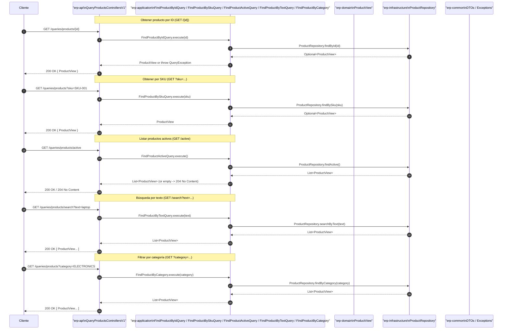

# Diagrama de secuencia — QueryProductsControllersV1

Descripción: Secuencia para búsquedas y consultas de productos: obtener por id, por sku, activos, búsqueda por texto, y por categoría. Capas: `erp-api`, `erp-application` (queries), `erp-domain` (views), `erp-infrastructure` (repos), `erp-common`.

