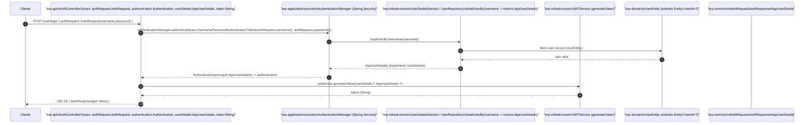

# Diagrama detallado — AuthController

Incluye: textos del flujo original, nombres de variables usados en el código, y clases base relevantes.

Variables relevantes en `AuthController`:

- `authRequest` : `AuthRequest` (record with `username`, `password`)
- `authentication` : `Authentication` (result of AuthenticationManager)
- `userDetails` : `AppUserDetails` (principal)
- `token` : `String` (JWT returned)

Clases base y estructuras importantes:

- `AuthRequest`, `AuthResponse` : `record`
- `AppUserDetails` : implements `UserDetails` (Spring Security)
- `JWTService` : service that generates JWT tokens
- `AuthenticationManager` : Spring Security interface
- `UserDetailsService` / `UserRepository` in infra

