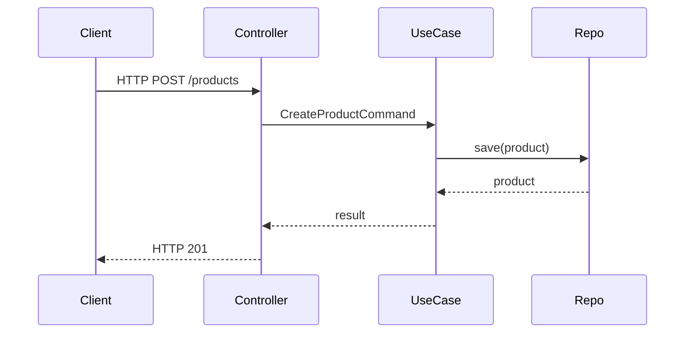

# erp-api

English

This module contains the HTTP API controllers, DTOs, configuration (OpenAPI, YAML config), and error handling. Controllers translate HTTP requests into application commands/queries and map application responses into HTTP responses.

Spanish

Este módulo contiene los controladores HTTP, DTOs, configuración (OpenAPI, YAML) y el manejo de errores. Los controladores traducen peticiones HTTP en comandos/queries de la aplicación y mapean las respuestas de la aplicación a respuestas HTTP.

Flow diagram (Mermaid):

References:

- Designing Web APIs: <https://restfulapi.net/>
- OpenAPI: <https://swagger.io/specification/>
