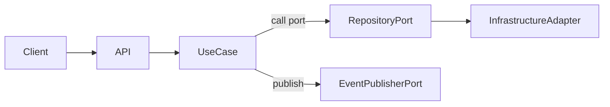

# erp-application

English

This package implements application services, use cases, commands, queries, and security services. It depends on domain ports and coordinates transactions, validation, and orchestration. Use cases are the application boundary that implement business workflows.

Spanish

Este paquete implementa servicios de aplicación, casos de uso, comandos, queries y servicios de seguridad. Depende de los puertos del dominio y coordina transacciones, validaciones y orquestación. Los casos de uso representan la frontera de la aplicación que ejecuta la lógica de negocio.

Flow diagram (Mermaid):

References:
- Clean Architecture overview: https://8thlight.com/blog/uncle-bob/2012/08/13/the-clean-architecture.html
- Commands and Queries (CQRS): https://martinfowler.com/bliki/CQRS.html
