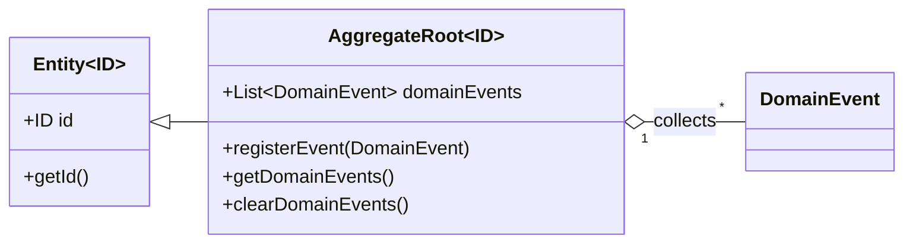

# erp-domain

English

This package contains domain entities, value objects, domain events, and port interfaces following DDD and Hexagonal architecture (Ports & Adapters). Key base classes:

- Entity<ID> — Base class for domain entities (identity-based equality).
- AggregateRoot<ID> — Extends Entity and collects DomainEvent instances for publication.
- DomainEvent — Marker interface for domain events.

Spanish

Este paquete contiene entidades del dominio, objetos de valor, eventos de dominio y puertos (interfaces) siguiendo DDD y Hexagonal (Puertos & Adaptadores). Clases base importantes:

- Entity<ID> — Clase base para entidades del dominio (igualdad por identidad).
- AggregateRoot<ID> — Extiende Entity y acumula DomainEvent para publicación.
- DomainEvent — Interfaz marcador para eventos de dominio.

Class diagram (Mermaid):

References:
- Domain-Driven Design community: https://dddcommunity.org/
- Hexagonal Architecture (Ports & Adapters): https://alistair.cockburn.us/hexagonal-architecture/
- Domain Events (martinfowler): https://martinfowler.com/articles/201701-event-driven.html
