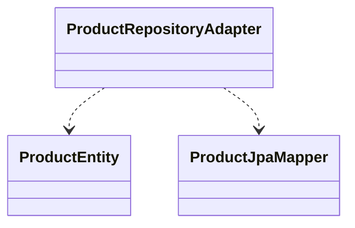

# erp-infrastructure

English

This package contains adapters, configurations, repositories, message publishers, and external client implementations. Infrastructure implements domain ports (adapters) and integrates with persistence (JPA, Mongo), messaging (RabbitMQ), storage (AWS S3), caching (Redis), and external REST providers.

Spanish

Este paquete contiene adaptadores, configuraciones, repositorios, publicadores de mensajes e implementaciones de clientes externos. La infraestructura implementa los puertos del dominio (adaptadores) e integra persistencia (JPA, Mongo), mensajería (RabbitMQ), almacenamiento (AWS S3), caching (Redis) y proveedores REST externos.

Class/Component diagram (Mermaid):

References:
- Ports & Adapters pattern: https://alistair.cockburn.us/hexagonal-architecture/
- Spring Data JPA reference: https://spring.io/projects/spring-data-jpa
